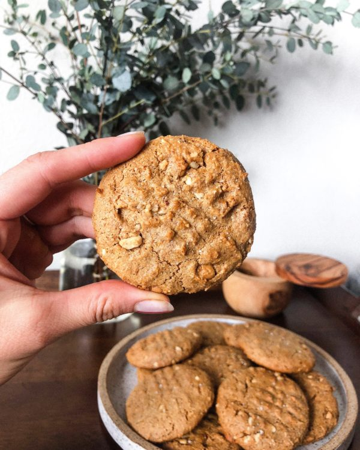

13.) I am uncertain whether "document <head> and <body> elements" refers to directly to the <head> and <body> elements used for structure or the metadata managing/structural/semantic markup-ing tool elements used to actually create the webpage.

For the latter, one's use of <head> elements seems limited by the amount of metadata needed to be managed/indexed and how much detail involved in the 'look' of the site. The number of <body> elements seems capped only by the amount of content/data one intends to present users with. The <body> elements involved would manipulate the format and emphasis of the content nigh-on endlessly, although this is unlikely to result in a quality web page.

For the former, while a page can have multiple <head> and <body> elements it should only have one of each. The <head> element will contain tools to manage metadata while the <body> element will contain tools for managing the visible content intended to be interacted with by users.

14.) Structural markups are used to embed information about the structure of a document, and enacts such through the use of elements like headings, paragraphs, breaks, and lists. Semantic markups emphasize particular segments of the information in a document by bolding, italicizing, or other means of implying emphasis.

15.) Work Cycle

Work Involved
  - Used new HTML markup elements to manage the structure of a webpage, such as additional meta elements in the <head> element and varying markup elements in the <body> element such as lists, URL link hypertext, and semantic markups.

I experimented with placing image links both inside and outside headers before determining that outside seemed more logical while inside seemed more organized. Specifically:

          <h1>Healthy-ish Peanut Butter Cookies!
           
          
          </h1>

  vs

          <h1>Healthy-ish Peanut Butter Cookies!
          </h1>

           

          

A reoccurring problem was the image link not displaying an image in the markdown preview but not on the live site.

I would like to learn how to manipulate photo sizes within the image link.
