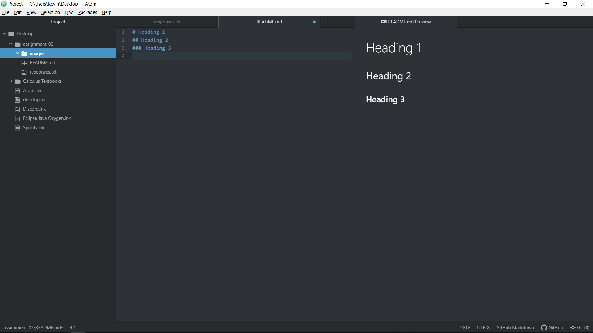

# Assignment 2
## Kevin Peel
###### I decided to take a web design class because I recently heard someone refer to the internet as humanity's 'rudimentary prosthetic hive mind'. With a declaration like that, learning how to better use/manipulate/create seemed a valuable lesson.

###### I have learned how data is transferred over the internet and why my Wifi is always so slow. (;
###### I've also learned the basics of using Atom and how cookies actually work.

 <!-- Testing comments function --> 

 By the power of truth, I, while living, have conquered the universe. I plan on reading Proust one of these days. Maybe. The text wrapping feature is nice but I wonder if there's a command to force line breaks.

[Red Markets Web App](http://redmarketsapp.atwebpages.com/index.html)

[My Responses](./responses.txt)

